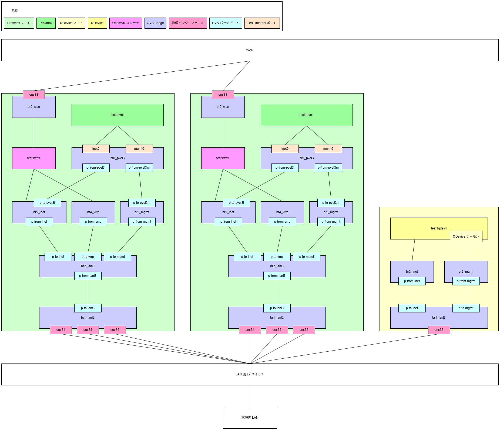

### proxmox-openwrt-redundant-router by Yuichi Yoshii is licensed under the Apache License, Version2.0

### 前提
このリポジトリのスクリプトは Proxmox クリーンインストール直後のノードで実行することを前提にしている  
それ以外の状態で実行する場合の動作確認はしていない

### このスクリプトでセットアップする Proxmox と OpenWrt の関係図

### セットアップ手順

#### ノード A
1. node-A/setup.pve.sh へ引数を記入
1. node-A/setup.openwrt.sh へ引数を記入
1. node-A/openwrt/setup.sh へ引数を記入
1. VRRP 用パスワードを生成
1. node-A/openwrt/init_interfaces へ引数を記入
1. node-A/setup.suricata.sh へ引数を記入 ( Suricata が必要な場合のみ )
1. node-A/suricata/setup.sh へ引数を記入 ( Suricata が必要な場合のみ )
1. ノード A へ SSH ログイン
1. ノード A へスクリプトを配置
1. setup.pve.sh を実行
    - 自動でログアウトする
1. setup.openwrt.sh を実行
1. setup.suricata.sh を実行 ( Suricata が必要な場合のみ )

#### ノード B
1. node-B/setup.pve.sh へ引数を記入
1. node-B/setup.openwrt.sh へ引数を記入
1. node-B/openwrt/setup.sh へ引数を記入
1. node-B/openwrt/init_interfaces へ引数を記入
1. node-B/setup.suricata.sh へ引数を記入 ( Suricata が必要な場合のみ )
1. node-B/suricata/setup.sh へ引数を記入 ( Suricata が必要な場合のみ )
1. ノード B へ SSH ログイン
1. ノード B へスクリプトを配置
1. setup.pve.sh を実行
    - 自動でログアウトする
1. setup.openwrt.sh を実行
1. setup.suricata.sh を実行 ( Suricata が必要な場合のみ )

#### QDevice ノード
1. qdev/setup.sh へ引数を記入
1. QDevice ノードへ SSH ログイン
1. QDevice ノードへスクリプトを配置
1. setup.sh を実行
